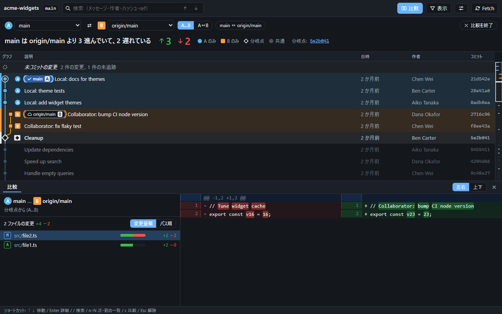

# orca-git-graph

[English](README.md)

[Orca](https://github.com/stablyai/orca) の**エディタ領域のタブ**として開く Git コミットグラフです。「一画面で全体が分かる」「ブランチやリモートとの差分がひと目で分かる」ことを最優先にしています。



## できること

- **リポジトリ全体を表示** — ローカルブランチ・リモートブランチ・タグをすべて含むレーングラフ（マージ、octopus マージ、複数ルートに対応）。先頭に「未コミットの変更」行も表示します。
- **任意の 2 つの ref を比較** — ローカルブランチ / リモートブランチ / タグ / `HEAD` を、ref バッジのクリックまたはセレクタで A・B として選択。ヘッダーに「main は origin/main より 3 進んでいて、2 遅れている」と大きく表示し、グラフ上で A だけ・B だけのコミットを強調、分岐点に目印を付け、共通の履歴は薄く表示します。変更ファイルは変更量順に並び、横棒で量を可視化。`A...B`（分岐点から）と `A..B`（直接比較）を切り替えられます。
- **色に頼らない表示** — A は丸、B は四角、分岐点はひし形で、それぞれ文字（A / B）も付きます。レーンの色は色覚多様性に配慮したパレットで、色が一巡すると線種が変わります。
- **自動更新** — `.git`（リンクされた worktree を含む）を監視し、スクロール位置・選択・比較状態を保ったまま差分更新します。**Fetch** ボタンは `git fetch --all --prune` を実行します。リポジトリを変更する操作はこれだけで、ボタンを押したときだけ動きます。
- **高速** — ページング取得と仮想スクロール。1 万コミットのリポジトリでも初回表示は約 1 秒、スクロールもなめらかです。ミニマップで、比較対象のコミットや ref が履歴全体のどこにあるか分かります。
- 検索（メッセージ・作者・ハッシュ・ref 名）、ref ごとの表示フィルタ、表示密度、日時の相対／絶対表示、ライト／ダークテーマ、キーボード操作。

## インストール（Orca プラグインとして）

1. Orca の **Settings → Plugins → Install from Git URL**
2. URL: `https://github.com/mazume-tech-club/orca-git-graph`、Ref: `plugin-dist`（または `v0.1.0` などのリリースタグ）
3. 要求される 2 つの権限を許可: 「フォーカス中のワークツリーの名前・ブランチの読み取り」と「通知の表示」
4. コマンドパレットから **Open Git Graph** を実行、またはショートカット **Ctrl/Cmd + Alt + Shift + O**

プラグインのショートカットはターミナルにフォーカスがあると反応せず、Orca のプラグイン API ではボタンも追加できません。代わりに、Orca の**クイックコマンド**に次を登録すると、ワークツリー内のターミナルから 1 クリックで開けます。

```sh
node <プラグインのフォルダ>/open.mjs
```

フォーカス中のワークツリーに、ブラウザタブとしてグラフが開きます。もう一度実行すると既存のタブに切り替わります。

対応するのはローカルのワークツリーのみです。SSH / リモートの Orca ワークスペースでは、開けない理由を通知で表示します。

> Orca のプラグイン API は experimental です。本プラグインは Orca 1.4.x を前提に作っています。依存している挙動は `CLAUDE.md` にまとめています。

## Orca なしで使う

```sh
pnpm install
pnpm dev -- --repo C:\path\to\repo    # URL が表示されます（ホットリロード）
# 本番相当の起動:
pnpm build
node packages/server/dist/server.mjs --repo C:\path\to\repo --web-dir packages/web/dist
```

Node.js 20 以上と、`PATH` 上の `git` が必要です。

## キーボード操作

| キー | 動作 |
|---|---|
| `↑` `↓` / `j` `k` | 選択を移動 |
| `Enter` | 詳細ペインの表示／非表示 |
| `/` | 検索。`Enter` / `Shift+Enter`、`n` / `N` で一致箇所を移動 |
| `c` | 比較の開始／終了 |
| `Esc` | 検索の解除 → 比較の終了 → 選択の解除 |

## 仕組み

```
Orca プラグイン（ワーカー）  「Git Graph を開く」→ フォーカス中のワークツリーを特定 → 必要ならサーバーを起動 → タブを開く
        │ detached プロセス。port/token は他ユーザーから読めないロックファイルで共有
ローカルサーバー（Hono）    127.0.0.1 のみ · 起動ごとにランダムなトークン · git は execFile · JSON API + SSE
        │ HTTP
Web UI（React・SVG・仮想スクロール）  Orca の内蔵ブラウザのタブで表示。通常のブラウザでも動作
```

セキュリティ: サーバーは `127.0.0.1` だけで待ち受け、全 API でランダムなトークンと `Host` ヘッダー（DNS リバインディング対策）を検証します。扱えるリポジトリは起動時に指定したもの（`--repo`）か、`orca worktree ps` が報告するワークツリーだけです。git は常に検証済みの ref を `execFile` で実行し、API は明示的な Fetch ボタンを除いて読み取り専用です。トークンを含むロックファイルはユーザーのデータディレクトリに置き、他ユーザーから読めない権限にしています。

## 開発

```sh
pnpm test          # 単体・結合テスト（core / platform / server / orca-plugin / web）
pnpm typecheck
pnpm build         # web → server → orca-plugin/dist
pnpm test:e2e      # Playwright。先に pnpm build、初回のみ pnpm --filter @orca-git-graph/web exec playwright install chromium
node scripts/make-demo-repo.mjs <dir>   # ahead/behind・マージ・タグ入りの架空リポジトリ
node scripts/release.mjs                # Git URL インストール用の配布ツリーを作成
```

構成: `packages/core`（パーサ・レーン配置・比較。I/O なし）、`packages/platform`（データディレクトリ・ロックファイル・`orca` CLI）、`packages/server`、`packages/web`、`packages/orca-plugin`。計画と進捗は `docs/PLAN.md`、Orca の API の挙動メモは `CLAUDE.md` にあります。

## ライセンス

MIT — [LICENSE](LICENSE) を参照。スクリーンショットは架空のリポジトリで作成しています。他の Git グラフツールのコードは含みません。
