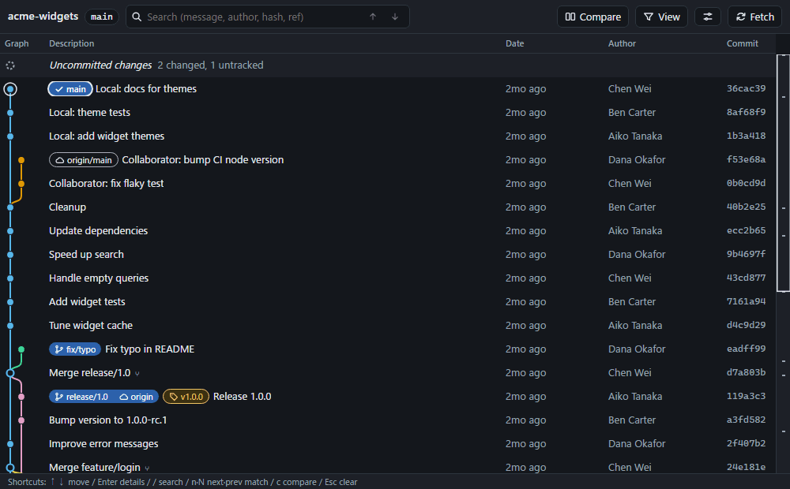

# orca-git-graph

[日本語](README.ja.md)

**See every branch, remote and tag — and exactly what separates any two of them — on one screen.**



A visual Git commit graph that works **inside [Orca](https://github.com/stablyai/orca) as an editor tab, or on its own in any browser — no Orca required.** It is read-only, runs entirely on your machine, and needs nothing but Node.js and `git`.

## Two ways to use it

**Standalone — any repository, any browser, no Orca:**

```sh
git clone --depth 1 --branch plugin-dist https://github.com/mazume-tech-club/orca-git-graph.git ~/orca-git-graph
cd /path/to/your/repo
node ~/orca-git-graph/server.mjs
```

**As an Orca plugin — one shortcut, opens as a tab in the focused worktree:**
Orca → *Settings → Plugins → Install from Git URL* → URL `https://github.com/mazume-tech-club/orca-git-graph`, Ref `plugin-dist` (details [below](#install-as-an-orca-plugin)).

## What you get

- **The whole repository** — all local branches, remote branches and tags in one lane graph (with merge commits, octopus merges, multiple roots), plus a row for uncommitted changes.
- **Compare any two refs** — pick A and B (local branch, remote branch, tag, `HEAD`) by clicking ref badges or from the selectors. The header says it in words and numbers (*"main is 3 ahead and 2 behind of origin/main"*), the graph highlights commits only in A / only in B, marks the merge base, and dims the shared history. Changed files are sorted by size with a bar per file. Switch between `A...B` (from the merge base) and `A..B` (direct).
- **Readable without colour** — A is a circle, B a square, the merge base a diamond, each also carries a letter; lanes use a colour-blind-safe palette and change dash pattern when colours repeat.
- **Stays current** — watches `.git` (including linked worktrees) and updates in place, keeping your scroll position, selection and comparison. A **Fetch** button runs `git fetch --all --prune`; it is the only thing that ever changes your repository, and only when you press it.
- **Fast** — paged loading and a virtualised list: first screen of a 10,000-commit repository in about a second, smooth scrolling. A minimap shows where the compared commits and refs are in the whole history.
- Search (message, author, hash, ref name), per-ref filter, density / relative-or-absolute dates / light-dark themes, keyboard control.

## Install (as an Orca plugin)

1. Orca → **Settings → Plugins → Install from Git URL**
2. URL: `https://github.com/mazume-tech-club/orca-git-graph`, Ref: `plugin-dist` (or a release tag such as `plugin-v0.1.0`)
3. Approve the three capabilities it asks for: *read the focused worktree's name, branch and terminal list*, *show notifications*, and *type text into a terminal you choose* (used only by the sidebar button below).
4. Run **Open Git Graph** from the command palette (**Ctrl/Cmd + Shift + J**), or press **Ctrl/Cmd + Alt + Shift + O**. Do this once even if you plan to use the button: it sets up the launcher file the button needs.

### One-click button (right sidebar)

The plugin adds a **Git Graph** panel to Orca's right sidebar (its icon is a pulse line; Orca only allows a fixed set of icons for plugins). Open it, pick a terminal, and press **Open Git Graph**.

- The button works by typing a short command into a terminal **that you pick**. Orca's plugin API offers no other way for a button to start something. Pick a plain shell; **do not pick a terminal where Claude Code or another agent is running**, because the text would go to its prompt. The panel never chooses a terminal for you.
- After you have picked a terminal, the choice is kept while the panel stays open, so later clicks are one click.

### Other ways to start it

Plugin shortcuts do not fire while a terminal has focus. As another one-click route, add an Orca **Quick Command** that runs the bundled CLI from a plain shell terminal inside the worktree:

```sh
node <plugin folder>/open.mjs
```

The graph opens as a browser tab in the focused worktree. Running the command again switches to the existing tab.

Local worktrees only. For SSH / remote Orca workspaces a message explains why nothing opens.

> Orca's plugin API is experimental. This plugin was written against Orca 1.4.x; see `CLAUDE.md` for exactly what it relies on.

## Run without Orca

From the release tree (no build step):

```sh
git clone --depth 1 --branch plugin-dist https://github.com/mazume-tech-club/orca-git-graph.git ~/orca-git-graph
cd /path/to/your/repo
node ~/orca-git-graph/server.mjs           # opens your browser; Ctrl+C to stop
```

`--repo <path>` (repeatable) shows other repositories; `--no-open` only prints the URL. From source, with hot reload:

```sh
pnpm install
pnpm dev -- --repo /path/to/repo
```

Requires Node.js 20+ and `git` on `PATH`. The server binds to `127.0.0.1` only, with a random token per run.

## Keyboard

| Key | Action |
|---|---|
| `↑` `↓` / `j` `k` | move selection |
| `Enter` | show / hide the detail pane |
| `/` | search; `Enter` / `Shift+Enter` or `n` / `N` step through matches |
| `c` | start / end comparison |
| `Esc` | clear search → end comparison → clear selection |

## How it works

```
Orca plugin (worker)      "Open Git Graph" → which worktree is focused? → start server if needed → open tab
        │ detached process, port/token in a private lock file
Local server (Hono)       127.0.0.1 only · random token per start · `git` via execFile · JSON API + SSE
        │ HTTP
Web UI (React, SVG, virtual scrolling)   shown in Orca's built-in browser tab; works in any browser
```

Security model: the server listens on `127.0.0.1` only, checks a random per-start token on every API call and the `Host` header (DNS-rebinding), and only serves repositories it was given (`--repo`) or that `orca worktree ps` reports. Git is always run through `execFile` with validated refs; the API is read-only apart from the explicit Fetch button. The lock file holding the token lives in your user data directory (mode 0600 / user-profile ACL).

## Development

```sh
pnpm test          # unit + integration tests (core, platform, server, orca-plugin, web)
pnpm typecheck
pnpm build         # web → server → orca-plugin/dist
pnpm test:e2e      # Playwright; run `pnpm build` first, and once: pnpm --filter @orca-git-graph/web exec playwright install chromium
node scripts/make-demo-repo.mjs /tmp/demo   # a fictional repository with ahead/behind, merges and tags
node scripts/release.mjs                    # produce the tree Orca installs from a Git URL
```

Layout: `packages/core` (parsers, lane layout, compare — no I/O), `packages/platform` (data dir, lock file, `orca` CLI), `packages/server`, `packages/web`, `packages/orca-plugin`. Plan and status: `docs/PLAN.md`. Notes on Orca's API behaviour: `CLAUDE.md`.

## License

MIT — see [LICENSE](LICENSE). The screenshots use a fictional repository. This project contains no code from other Git graph tools.
